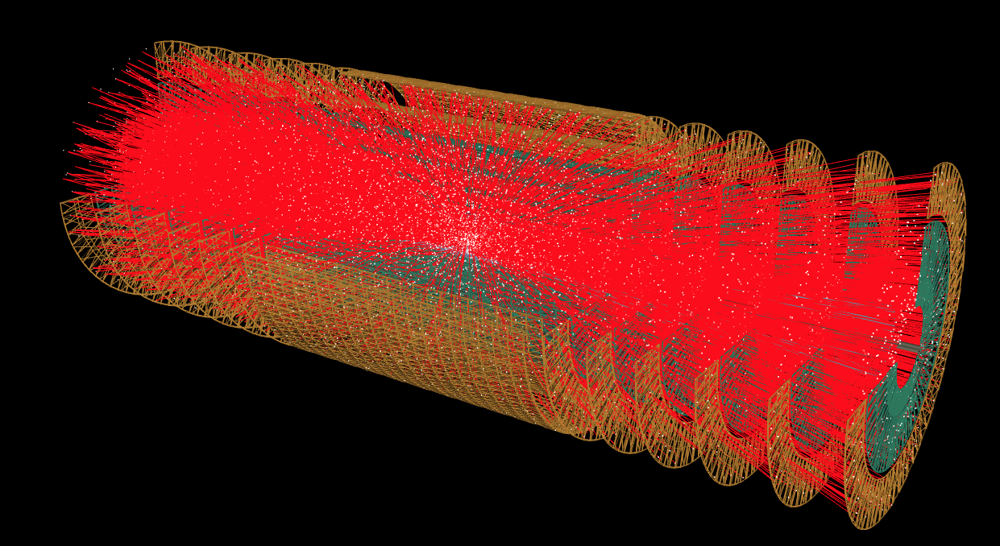

## Implementation and Optimisation in ACTS of algorithms exposed in TrackML challenge

Hi, My name is Sharad Chitlangia and this page describes the details of my Google Summer of Code 2019 with CERN-HSF. My work is currently being merged in the main framework repository ([merge request](https://gitlab.cern.ch/acts/acts-framework/merge_requests/152)): . The complete code can be found on github [here](https://github.com/Sharad24/acts-framework), where I primarily worked on the Reconstruction directory inside Algorithms.

I worked on porting three Particle Track Reconstruction algorithms into acts-framework and exploring few other tasks. [ACTS](https://gitlab.cern.ch/acts) stands for A Common Tracking Software aims to provide a set of tools for the ATLAS experiment encapsulating track reconstruction software into a generic, framework- and experiment-independent software package. The three Track Reconstruction algorithms were exposed in the recent competitions on [trackml](https://sites.google.com/site/trackmlparticle/) hosted on [Kaggle](https://www.kaggle.com/c/trackml-particle-identification) and Codalab. They are described in a bit more detail below.

### 1. Data

The Data is created through highly accurate simulation of proton proton beam collisions using the acts-framework. Sample Data can be generated by running the `ACTFWGenericFatrasExample` binary. There are about a 100,000 hits and around 10,000 tracks to recontruct in the data provided in the official competitions but the parameters for different amounts of pileup can be set using program options of `ACTFWGenericFatrasExample` binary. An image of a sample event is shown below. The hits are in white and tracks are in red. Sample data from the Accuracy phase of the competition can be found on [Kaggle](https://www.kaggle.com/c/trackml-particle-identification/data).
 


### 2. Top-quarks Tracker

This tracker stood 1st in the competition held on Kaggle. It is one of the most elegant solutions in the sense that it utilises the features of the geometry of detectors efficiently which not a lot of other solutions from the first phase of the competition on Kaggle did. The complete tracking can be divided into 5 different steps:
1. Pair Prediction using Logistic Regression
2. Triplet Prediction
3. Extension of Triplets to Tracks
4. Addition of duplicates to tracks
5. Final track assignment

The final 3 steps utilise a unique Outlier Density Estimation Method which is also used by one of the top performers of the second phase. The official documentation of the solution is [here](https://github.com/top-quarks/top-quarks/blob/master/top-quarks_documentation.pdf)

This algorithm `Topquarks` can be run in the framework in the example binaries by appending the algorithm to the Sequencer in the Reconstruction.cpp example. It's important to set the right paths for the data in the code before trying to run them. A short example is given below:

```
Topquarks::Config reconstruct;
reconstruct.spacePointCollection = digi.spacePointCollection;
seq.appendEventAlgorithms(
    {std::make_shared<Topquarks>(reconstruct, logLevel)});
```

### 3. Directed Acyclic Graphs based Neural Network Tracker

This tracker stood 3rd in the second phase of the competition and in essence just better the initial pair and triplet prediction of the Top-quarks tracker. It utilises 3 Neural Network in total, 2 for pair prediction and 1 for triplet prediction. The data for the pair and triplet predictions is organised in a Directed Acyclic Graph which helps is easing the pair and triplet finding. After the triplets are predicted, the final tracks are obtained using the same method used by the Top-quarks tracker i.e., Outlier Density Estimation. The official documentation of the solution is [here](https://github.com/marcelkunze/trackml/blob/master/doc/Marcel_Kunze_TrackML_AlgorithmDescription.pdf)

This algorithm `DAGbasedNNTracker` can be run in the framework in the example binaries by appending the algorithm to the Sequencer in the Reconstruction.cpp example. It's important to set the right paths for the data in the code before trying to run them. A short example is given below:

```
DAGbasedNNTracker::Config reconstruct;
reconstruct.spacePointCollection = digi.spacePointCollection;
seq.appendEventAlgorithms(
    {std::make_shared<DAGbasedNNTracker>(reconstruct, logLevel)});
```

### 4. Mikado Tracker

This tracker stood 1st in the second phase of the competition and is currently one of the best and probably simple approaches to solving the problem of track reconstruction. The algorithm builds by first defining some sets of parameters by running analysis on sample data. Then it builds local 3-hit helices by building from a single hit then looking for a second hit followed by the third hit. The search area for these hit finding are defined in the parameters. This is followed by tracklet prolongation which is done by extending the 3-d helix. The helix is discarded if no hits can be found and is kept if hits are found. Final hits are assigned by identifying the best tracks. The official documentation of the solution is [here](https://gitlab.com/sgorbuno/MikadoTracker/blob/master/doc/MikadoTrackerForTrackML.pdf)

This algorithm `MikadoTracker` can be run in the framework in the example binaries by appending the algorithm to the Sequencer in the Reconstruction.cpp example. It's important to set the right paths for the data in the code before trying to run them. A short example is given below:

```
MikadoTracker::Config reconstruct;
reconstruct.spacePointCollection = digi.spacePointCollection;
seq.appendEventAlgorithms(
    {std::make_shared<MikadoTracker>(reconstruct, logLevel)});
```

### 5. Other Tasks

I also worked on some other tasks like building a pytorch recontruction example using the C++ frontend of pytorch - [libtorch](https://pytorch.org/cppdocs/). This example shows how to load a pytorch model using `torch::jit::load` as a `torch::jit::script::Module`. An example with running inference on this model is shown below:

```
torch::jit::script::Module module;
module = torch::jit::load("/tmp/tmp.pb");

// Declare sample input
std::vector<torch::jit::IValue> inputs;
inputs.push_back(torch::ones({2, 8}));

// Get output
at::Tensor output = module.forward(inputs).toTensor();

// Print Output
ACTS_INFO(output);
```

### 6. Future Work

### 7. Acknowledgements
